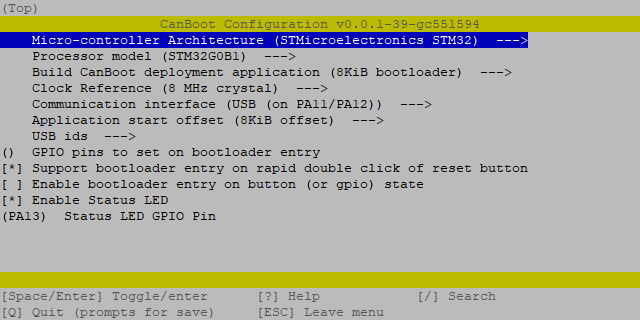

# BigTreeTech EBB

<br>

<p>This is an instruction to set up the BTT EBB36, EBB42 and EBB S<i>(tealth)</i>B<i>(urner)</i> with Klipper via CANBUS.</p>
<br>
<p>This guide was verified on a Pi running <a href="https://github.com/mainsail-crew/MainsailOS">MainsailOS</a></p>
<br>

> ⚠ Use at least a Klipper version of v0.10.0-531 to use the board safely! \
> In [this commit](https://github.com/Klipper3d/klipper/commit/3796a319599e84b58886ec6f733277bfe4f1a747), Kevin fixed a bug in the ADC calculation of the STM32G0.

<br>
<br>
<br>

<h2>
  <b>This guide got moved over to the <a href="https://docs.meteyou.wtf">new collaborative docs by meteyou and myself</a></b>
</h2>
<br>
<br>
<br>
<br>
<br>
<br>
<br>

<hr>

<h2 id="misuse">
  Hacky appendix: Misuse an EBB as a Klipper USB-to-CAN bridge
</h2>
<br>
<ul>
  <li>Hacky appendix index:</li>
  <br>
  <ul>
    <li><a href="#misuse">Introduction - why the heck?</a></li>
    <br>
    <li><a href="#misuse-canboot">CanBoot configuration</a></li>
    <li><a href="#misuse-klipper">Klipper configuration</a></li>
    <li><a href="#misuse-can0">Add can0 interface</a></li>
    <li><a href="#misuse-mcu">Add EBB as additional MCU to Klipper</a></li>
    <br>
    <li><a href="#misuse-update">Update CanBoot/Klipper</a></li>
  </ul>
  </li>
</ul>
<br>
<br>
<br>
<details><summary><i>Click here to expand this section</i></summary>

<br>

When [I (docgalaxyblock)](https://github.com/docgalaxyblock) wanted to place my order the U2C was sold out. \
So I ordered two EBB(36) and misuse one of them as a USB-to-CAN interface.

*A small benefit is that I now have some additional ports - I would not have them if I bought a U2C*

If you also like to misuse one of your EBB as a USB-to-CAN follow the upper guide but just use these CanBoot and Klipper configurations:

<br>

<h3 id="misuse-canboot">
  EBB USB-to-CAN CanBoot
</h3>

<br>

<p>head over to the <a href="#canboot-config">normal CanBoot configuration</a> but use following settings instead:</p>

- Micro-controller Architecture: **STMicroelectronics STM32**
- Processor model: **STM32G0B1**
- Build CanBoot deployment application: **8KiB bootloader**
- Clock Reference: **8 MHz crystal**
- Communication interface: **USB (on PA11/PA12)**
- Support bootloader entry on rapid double click of reset button: **check** *(optional but recommend)*
- Enable Status LED: **check**
- Status LED GPIO Pin: **PA13**

this should then look like this:

<p align="center"></p>

<hr style="width:90%">

<h3 id="misuse-klipper">
  EBB USB-to-CAN Klipper
</h3>

<br>

<p>head over to the <a href="#klipper-config">normal Klipper configuration</a> but use the following settings instead:</p>

- Enable extra low-level configuration options: **check**
- Micro-controller Architecture: **STMicroelectronics STM32**
- Processor model: **STM32G0B1**
- Bootloader offset: **No bootloader** *(without CanBoot)*
- Bootloader offset: **8KiB bootloader** *(with CanBoot)*
- Clock Reference: **8 MHz crystal**
- Communication interface: **USB to CAN bus bridge (USB on PA11/PA12)**
- CAN bus interface: **CAN bus (on PB0/PB1)**
- Application start offset: **8KiB offset**
- CAN bus speed: **500000**

The result should look like this:

<p align="center"></p>

To flash Klipper ...

<br>

<p>... the classic way with an USB cable + <code>dfu-util</code> and without CanBoot: head over to the <a href="#--flash-klipper-">normal Klipper dfu-flashing method</a></p>

<br>

<details><summary>... with the help of CanBoot <i>(click to expand)</i></summary>

<br>

> The EBB must be in bootloader mode. \
> The status led should blink in bootloader mode. \
> If not double press the reset button to enter the bootloader

```bash
# find your <serial device> full path
ls /dev/serial/by-id/*
# the result should be `/dev/serial/by-id/usb-CanBoot_stm32g0b1...`
#
# and flash klipper to it
python3 ~/CanBoot/scripts/flash_can.py -f ~/klipper/out/klipper.bin -d <serial device>
```

<p align="center"></p>

<br>

</details><!-- end of "misuse canboot flash klipper" -->

<hr style="width:90%">

<h3 id="misuse-can0">
  Add can0 interface in mainsailOS
</h3>

Now you only have to create the interface in the OS. \
To do this, create the file `/etc/network/interfaces.d/can0` and fill it with the following content.

```bash
# open file with nano
sudo nano /etc/network/interfaces.d/can0
```

Content of `/etc/network/interfaces.d/can0`:

```
allow-hotplug can0
iface can0 can static
    bitrate 500000
    up ifconfig $IFACE txqueuelen 128
```

> The first line must be different here. Instead of `auto can0`, we use `allow-hotplug can0` because Klipper can
> restart the MCU, and the USB-to-CAN adapter is also restarted. \
> Thus the OS can reactivate the interface automatically.

To save and close the nano editor:  
`ctrl+s` => save file  
`ctrl+x` => close editor

After a reboot, the can0 interface should be ready.

<h3 id="misuse-mcu">
  Add EBB as additional MCU to Klipper
</h3>

Now add the EBB to your Klipper `printer.cfg` with its UUID - *(discover instructions below)*.

```yaml
[mcu EBB_USB-CAN]
canbus_uuid: <uuid>

# embedded temperature sensor
[temperature_sensor EBB_U-C]
sensor_type: temperature_mcu
sensor_mcu: EBB_USB-CAN
min_temp: 0
max_temp: 100
```

If you do not use CanBoot and want to find the UUID of your EBB use this command:

```bash
~/klippy-env/bin/python ~/klipper/scripts/canbus_query.py can0
```

The output should look like this:

<p align="center"></p>

<p><i>CanBoot users have already discovered their UUID at the <a href="#klipper-flash">Flash Klipper ... with the help of CanBoot</a> section</i></p>

<h3 id="misuse-update">
  Update ...
</h3>

<br>

... the classic way with an USB cable + <code>dfu-util</code> and without CanBoot

<ul>
  <li>continue if you would <a href="#misuse-canboot">flash CanBoot for the first time with <code>dfu-util</code></a></li>
  <li>continue if you would <a href="#misuse-klipper">flash Klipper for the first time with <code>dfu-util</code></a></li>
</ul>

<br>

<details><summary>... with the help of CanBoot itself <i>(click to expand)</i></summary>

<br>

Since the board can only be addressed via CAN, further CanBoot/Klipper updates must also be flashed to the board via CAN. \
This is very easy with the CanBoot bootloader:

```bash
# restart the mcu into CanBoot
python3 ~/CanBoot/scripts/flash_can.py -r -i can0 -u <uuid>
# the status led should blink now in bootloader mode
#
# and...
# ... to update CanBoot
python3 ~/CanBoot/scripts/flash_can.py -f ~/CanBoot/out/canboot.bin -d <serial device>
# ... to update Klipper
python3 ~/CanBoot/scripts/flash_can.py -f ~/klipper/out/klipper.bin -d <serial device>
```

<p align="center"></p>
<p align="center"></p>

</details><!-- end of "Misuse updating..." -->

</details><!-- end of "Misuse an EBB..." -->
